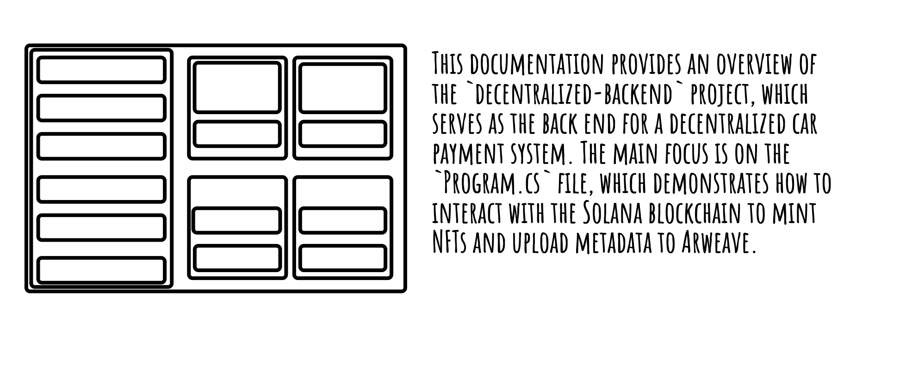

# decentralized-backend
The back end code for the decentralized car payment system. 

# Program.cs

This file contains the main entry point for the application. It demonstrates how to interact with the Solana blockchain to mint an NFT and upload metadata to Arweave.

## Overview

The program performs the following tasks:
1. Reads a private key from environment variables.
2. Uploads an image file to Arweave and retrieves its URI.
3. Creates metadata for an NFT.
4. Interacts with the Solana blockchain to mint the NFT.

## Key Features

### Environment Variables
- `PRIVATE_KEY`: The private key for the Solana wallet.
- `ARWEAVE_KEY`: The API key for accessing Arweave.

### Functions

#### `Main(string[] args)`
The main entry point of the program. It:
- Validates the presence of the `PRIVATE_KEY` environment variable.
- Calls `UploadToArweaveAsync` to upload an image to Arweave.
- Constructs metadata for the NFT.
- Mints the NFT on the Solana blockchain.

#### `UploadToArweaveAsync(string filePath)`
Uploads a file to Arweave and returns the URI of the uploaded file.

**Parameters:**
- `filePath`: The path to the file to be uploaded.

**Returns:**
- A `string` containing the URI of the uploaded file.

**Exceptions:**
- Throws `InvalidOperationException` if the `ARWEAVE_KEY` environment variable is not set or if the response from Arweave does not contain a `uri` field.

## Dependencies

The program relies on the following libraries:
- `Newtonsoft.Json.Linq`: For handling JSON data.
- `Solnet.Rpc`: For interacting with the Solana blockchain.
- `Solnet.Wallet`: For managing Solana wallets.
- `System.Net.Http`: For making HTTP requests.
- `System.IO`: For file operations.

## Example Usage

1. Set the required environment variables:
   ```bash
   export PRIVATE_KEY="your-private-key"
   export ARWEAVE_KEY="your-arweave-key"